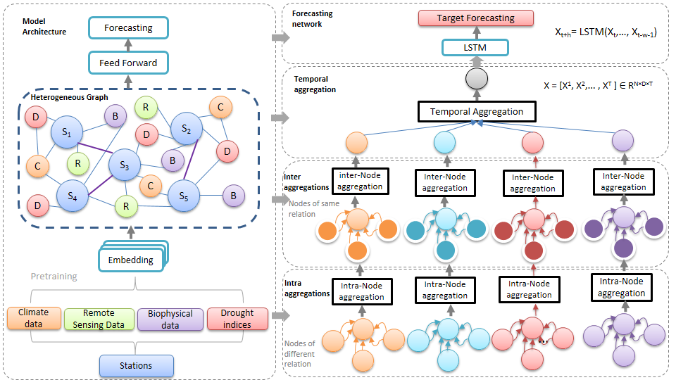

## HetSPGraph: Spatio-temporal Heterogeneous Graph using Multivariate Earth Observation Time Series
This is a PyTorch implementation of the paper : Heterogeneous Spatio-temporal Graph using Multivariate Earth
Observation Time Series: Application for drought forecasting (submitted to [Computers and Geosciences](https://www.sciencedirect.com/journal/computers-and-geosciences)) 

The aim oh this project is to provide a model that explores the Multivariate Earth Observation Time Series using HetSPGraph.
The main characteristics of HetSPGraph are:
- A novel HetSPGraph approach with three layers is proposed
- Dynamic spatiotemporal correlation at multi-time scales can be described by HetSPGraph
- The HetSPGraph model can keep its stable accuracy at long-term forecasting period


## Hardware and Software Requirements
This code was tested on a system with the following specifications:
- OS: Ubuntu 18.04 LTS
- Memory (RAM): 32GB
- disk storage: 1TB
- GPU: 1x NVIDIA GeForce GTX 1650

The model is implemented using Python3 with dependencies specified in requirements.txt.
- matplotlib 3.1.1
- numpy 1.17.4
- pandas 0.25.3
- scipy 1.4.1
- torch 1.2.0
- scikit_learn 0.23.1
## Dataset
The observed hydroclimatic data and the SPEI data used in this study are available from the author Yanfang Sang upon request (sangyf@igsnrr.ac.cn).

## Model Training
```
python train_multi_step.py --adj_data <GraphSensor> --data <data> --num_nodes <num_nodes>
```
## Related code

- STGCN: https://github.com/hazdzz/STGCN
- LSTM: https://github.com/jaungiers/LSTM-Neural-Network-for-Time-Series-Prediction
- GRU: https://github.com/zhangxu0307/time-series-forecasting-keras
- CNN-LSTM: https://github.com/ozancanozdemir/CNN-LSTM


